# OTP Protection Service - Проект для Promo IT

Backend-приложение на языке Java для обеспечения безопасности операций с помощью временных одноразовых кодов (OTP). Сервис поддерживает регистрацию пользователей, генерацию кодов с настраиваемыми параметрами и рассылку через различные каналы связи.

## Технологический стек
- **Java 17** и **Spring Boot 3.2.1**
- **JDBC** (Взаимодействие с БД PostgreSQL без использования ORM)
- **PostgreSQL 17**
- **JWT (JSON Web Tokens)** для аутентификации и авторизации по ролям
- **BCrypt** для безопасного хеширования паролей
- **SMPP (JSMPP)** — интеграция с SMS-эмулятором
- **Jakarta Mail** — отправка уведомлений на реальную почту
- **Telegram Bot API** — мгновенная доставка кодов через бота
- **Quartz/Scheduling** — автоматическая очистка просроченных кодов

## Архитектура проекта
Проект реализован согласно требованиям ТЗ с разделением на слои:
- **API (Controllers):** Обработка HTTP-запросов и валидация входящих данных.
- **Service Layer:** Основная бизнес-логика (генерация OTP, логика рассылки, проверка прав).
- **DAO (Data Access Object):** Выполнение SQL-запросов к PostgreSQL через JDBC.
- **Security:** Использование Interceptor для проверки JWT и разграничения доступа (USER/ADMIN).

---

## Отчет о работе сервиса (Скриншоты)

### 1. Запуск системы
Приложение успешно инициализирует пул соединений с базой данных и запускает планировщик задач.
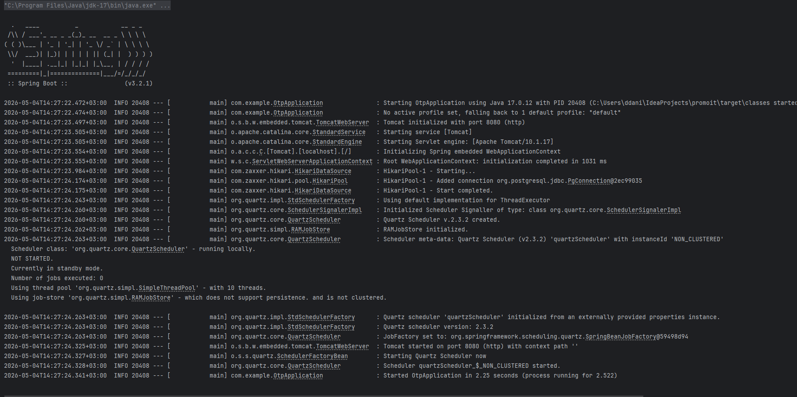

### 2. Регистрация и Аутентификация
Реализована регистрация пользователей с ролями. При логине выдается JWT токен с ограниченным сроком действия.
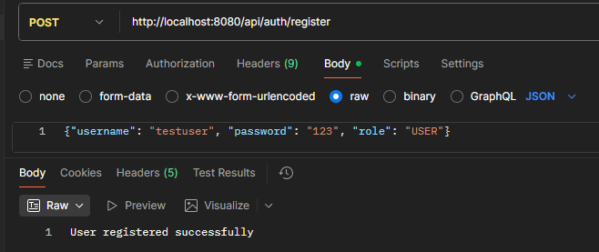
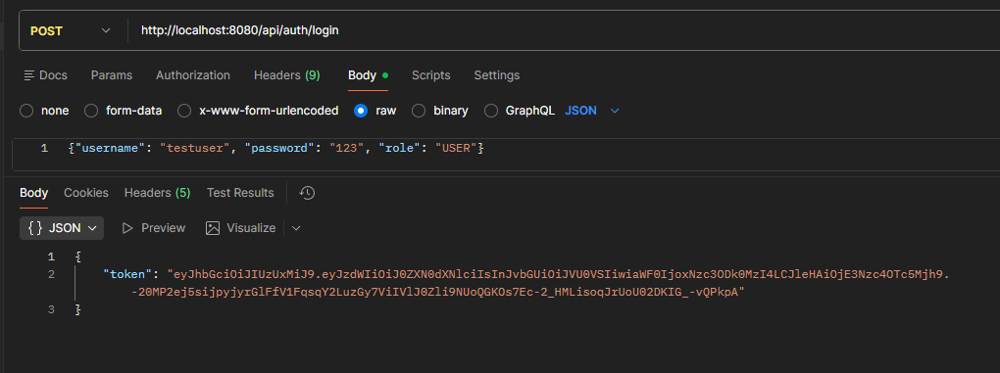

### 3. Генерация OTP кодов (Каналы рассылки)

#### SMS (через эмулятор SMPPsim)
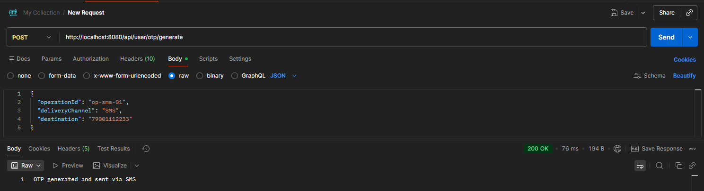

#### Email (Интеграция с Gmail)
Письмо успешно доставляется на реальный почтовый адрес.
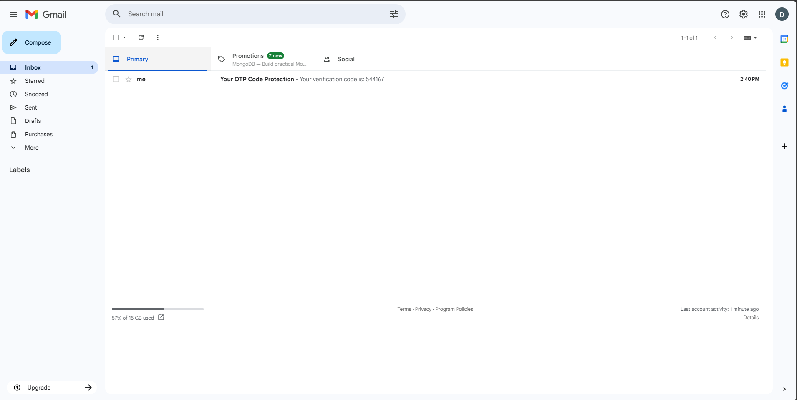
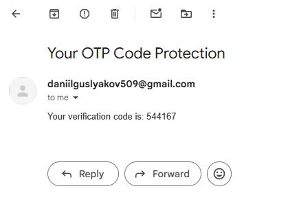
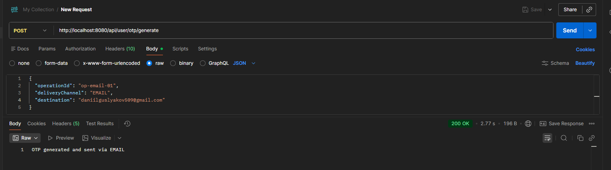

#### Telegram (Бот)
Реализована отправка через Telegram Bot API.
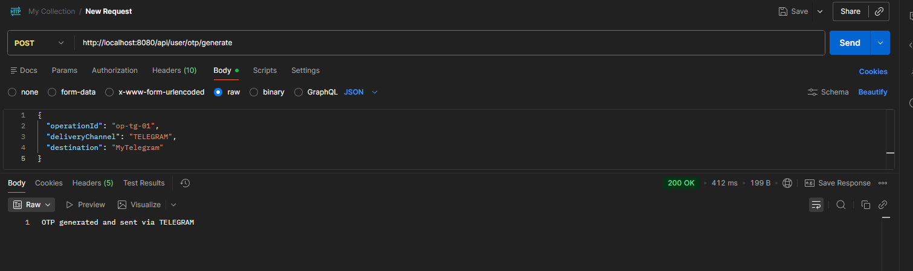

#### Сохранение в файл
Дополнительный способ получения кода через локальный файл `otp_codes.txt`.
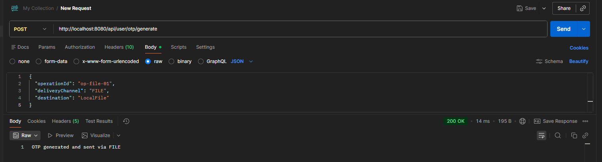
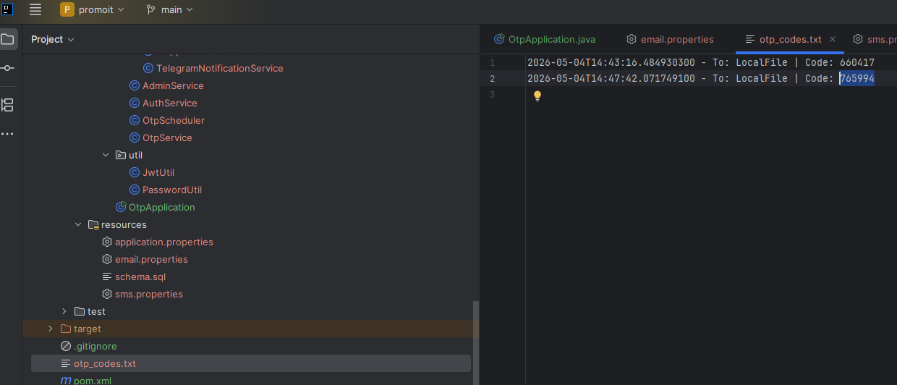

### 4. Валидация кода
Проверка кода на соответствие, принадлежность пользователю и срок годности.
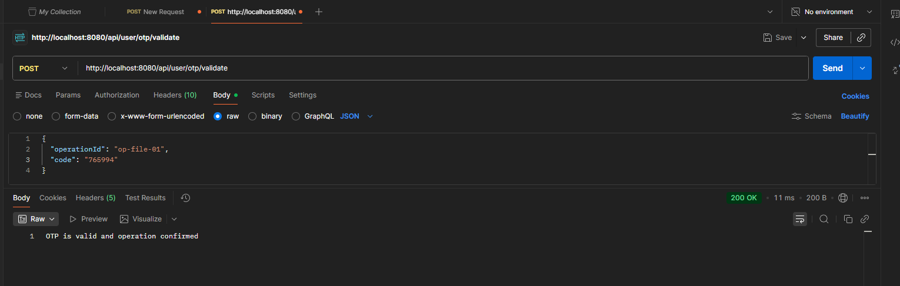

### 5. API Администратора
Администратор имеет права на изменение длины кода и времени его жизни (TTL).
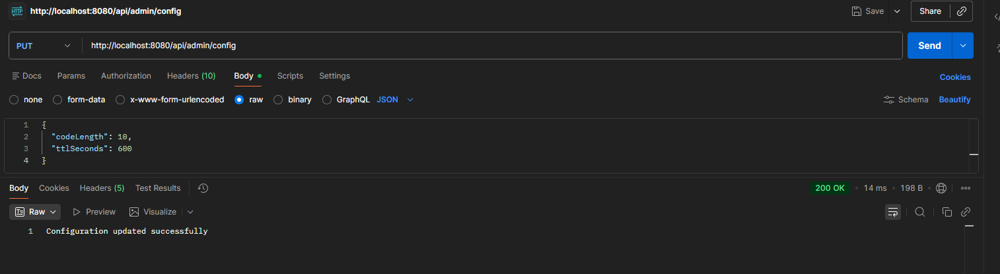

### 6. Подробное логирование
В системе реализовано детальное логирование всех этапов обработки запроса, включая работу планировщика по отметке просроченных кодов (статус `EXPIRED`).
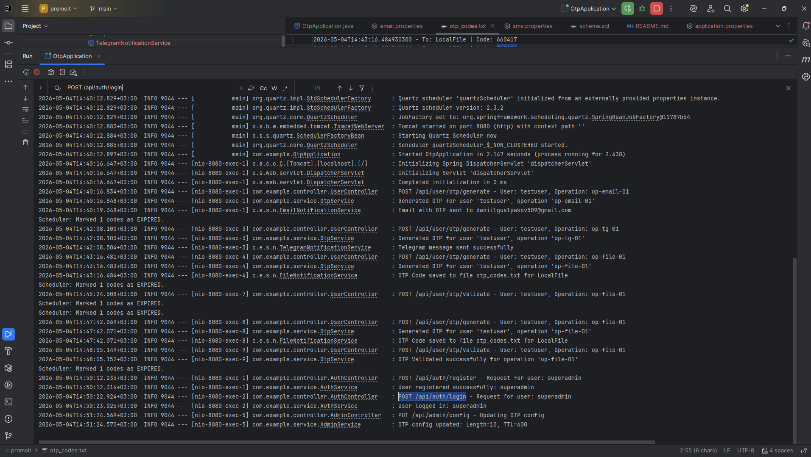

---

## Настройка и запуск

1.  **База данных:** Создать БД PostgreSQL и настроить доступы в `application.properties`. Таблицы создаются автоматически через `schema.sql`.
2.  **SMS:** Запустить SMPPsim эмулятор на порту 2775.
3.  **Email:** Указать валидный Gmail и "Пароль приложения" в `email.properties`.
4.  **Telegram:** Создать бота через @BotFather и указать Token/ChatID в `application.properties`.
5.  **Сборка:** Выполнить команду `mvn clean install`.
6.  **Запуск:** Запустить класс `OtpApplication`.
